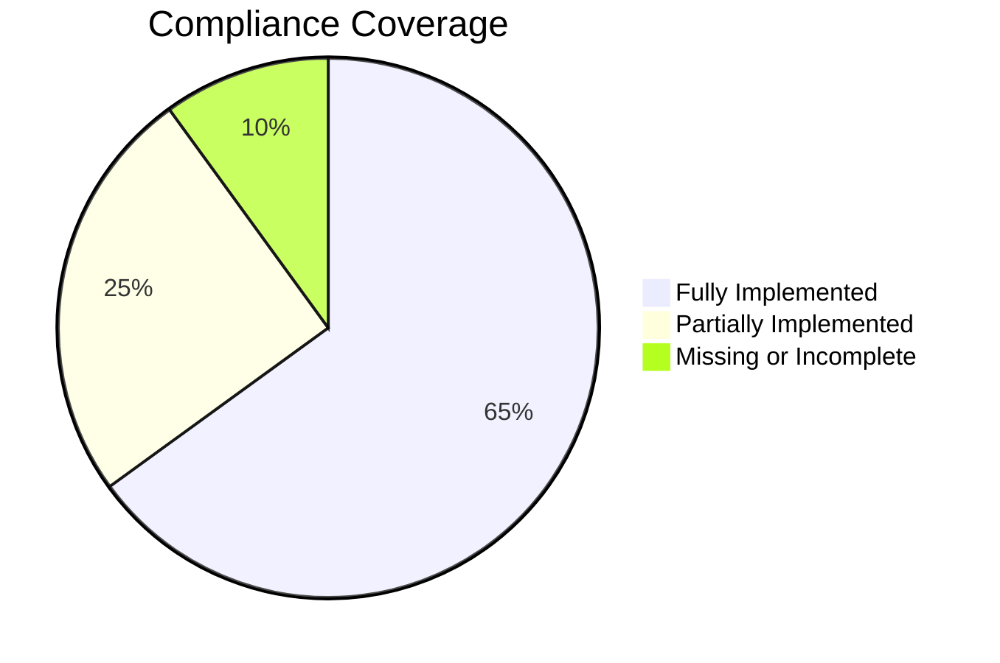

# SimplyDent_RAG — Comprehensive Audit vs. AGENTS.md

**Audit Date:** 2026-06-15  
**Test Suite:** 133/134 passed (1 skipped: DB connection)

---

## Overall Assessment

The project has a **solid foundation** and follows the AGENTS.md architecture well. The key modules exist and are well-structured. However, there are several gaps between the spec and the implementation that range from critical (blocking correct operation) to nice-to-have improvements.



---

## 🔴 Priority Issues (Blocking / Critical)

These need to be fixed first as they can cause incorrect chatbot behavior.

---

### P1. FAQ intent bypasses LLM generation entirely

**File:** [chat.py](file:///Users/linh_xu/Work/Lab/SimplyDent_RAG/app/services/chat.py#L414-L416)

```python
def _should_use_llm(...) -> bool:
    if intent == Intent.FAQ:
        return False  # ← Always False for FAQ!
    return plan.uses_hybrid
```

**Impact:** FAQ answers are always returned raw from the database `faq.answer` field without any LLM processing. This means:
- No reformatting or contextual adaptation of the answer
- `expected_answer_type: "rag"` eval cases for FAQ will fail
- When hybrid retrieval finds relevant chunks (not just FAQ records), they are ignored

**AGENTS.md requirement:** _"FAQ may use semantic search, direct FAQ search, or both."_

**Fix proposal:**
```python
def _should_use_llm(...) -> bool:
    if intent == Intent.PRODUCT_COMPARE:
        return len(structured) >= 2
    if intent == Intent.FAQ:
        # Use LLM when hybrid retrieval was triggered
        return plan.uses_hybrid
    return plan.uses_hybrid
```

---

### P2. `PRODUCT_DETAIL` / `SERVICE_DETAIL` with no entities crashes with `IndexError`

**File:** [structured_retriever.py](file:///Users/linh_xu/Work/Lab/SimplyDent_RAG/app/retrieval/structured_retriever.py#L62-L63)

```python
if intent == Intent.PRODUCT_DETAIL:
    product = self.get_product(session, entities[0] if entities else query)
```

When `entities` is empty, it falls back to the raw `query`, but if `query` is something like `"sản phẩm giá 100k"` (no entity), `get_product` returns `None`, and then `.retrieve()` returns `[]`. This is OK, but the **entity_resolver** is called first and `entities[0]` elsewhere can crash.

More critically in the planner at [planner.py](file:///Users/linh_xu/Work/Lab/SimplyDent_RAG/app/retrieval/planner.py#L94-L100):
```python
if intent in {Intent.PRODUCT_DETAIL, Intent.SERVICE_DETAIL}:
    if not structured:
        return self._plan(RetrievalMode.CLARIFY, ...)
```

This returns CLARIFY when no structured match is found, but **never falls back to hybrid/RAG**. Per AGENTS.md: _"ambiguous or missing entities require clarification instead of general RAG"_ — this is correct for entity-based queries, but when a user asks a general question about a product feature (e.g., `"bàn chải điện có tốt không?"`), the router may classify as `PRODUCT_DETAIL` without an entity, and no fallback to RAG occurs.

**Fix proposal:** Add a fallback to hybrid for low-confidence entity queries that have dental signal.

---

### P3. Missing partial unique indexes for active business records

**AGENTS.md §5.2:** _"PostgreSQL partial unique indexes must enforce one active normalized product name, service name, FAQ question, and clinic-info key."_

**File:** [models.py](file:///Users/linh_xu/Work/Lab/SimplyDent_RAG/app/db/models.py)

No partial unique indexes are defined on `products`, `services`, `faqs`, or `clinic_info` tables. This means:
- Two active products with the same normalized name can coexist
- Business dedup in [business_dedup.py](file:///Users/linh_xu/Work/Lab/SimplyDent_RAG/app/ingestion/business_dedup.py) handles this in application code, but **a race condition or direct SQL insert can bypass it**

**Fix proposal:** Add migrations with partial unique indexes:
```sql
CREATE UNIQUE INDEX uq_products_active_name 
  ON products (lower(name)) WHERE status = 'active';
CREATE UNIQUE INDEX uq_services_active_name 
  ON services (lower(name)) WHERE status = 'active';
CREATE UNIQUE INDEX uq_faqs_active_question 
  ON faqs (lower(question)) WHERE is_active = true;
CREATE UNIQUE INDEX uq_clinic_info_active_key 
  ON clinic_info (lower(key)) WHERE status = 'active';
```

---

### P4. Embedding dimension not validated against PostgreSQL `vector(n)` at startup correctly

**File:** [config.py](file:///Users/linh_xu/Work/Lab/SimplyDent_RAG/app/config.py#L39) — `validate_embedding_on_startup: bool = True`

The startup validation in [main.py](file:///Users/linh_xu/Work/Lab/SimplyDent_RAG/app/main.py#L39-L41) calls `chat_service.dense.embedder.validate_configuration(session)`, but this needs to verify:
1. The model loads successfully
2. The actual model dimension matches `EMBEDDING_DIM`
3. The PostgreSQL `vector(n)` column matches

**AGENTS.md §5.2:** _"Production defaults must fail fast when the model cannot load or its dimension does not match EMBEDDING_DIM and the PostgreSQL vector columns."_

Verify that `validate_configuration` checks all three conditions and raises a fatal error.

---

### P5. `review_only_reasons` vs `approval_blocking_reasons` not clearly separated

**AGENTS.md §5.2:** _"Keep review_reasons, review_only_reasons, and approval_blocking_reasons separate. Review-only reasons may be acknowledged by an explicit manual approval. Integrity blockers may not be waived."_

**Current implementation:** [review_policy.py](file:///Users/linh_xu/Work/Lab/SimplyDent_RAG/app/ingestion/review_policy.py) has `split_review_reasons()`, and the quality report does have `review_only_reasons` and `approval_blocking_reasons` fields. But in [pipeline.py](file:///Users/linh_xu/Work/Lab/SimplyDent_RAG/app/ingestion/pipeline.py#L430-L433):
```python
review_reasons = list(dict.fromkeys(review_reasons))
final_status = "review_required"
if self.settings.auto_approve_ingestion and not review_reasons:
    final_status = "active"
```

All reasons are treated equally — even review-only reasons block auto-approval. The quality report field `approval_blocking_reasons` is computed but **not used as the gate** for auto-approval.

**Fix proposal:** Only block auto-approval for blocking reasons:
```python
split = split_review_reasons(review_reasons)
if self.settings.auto_approve_ingestion and not split.integrity_blockers:
    final_status = "active"
```

---

## 🟡 Improvement Issues (Recommended)

These should be addressed to improve reliability and evaluation accuracy.

---

### I1. Evaluation dataset has only 31 cases — insufficient for reliable metrics

**File:** [dental_basic_eval.jsonl](file:///Users/linh_xu/Work/Lab/SimplyDent_RAG/eval_datasets/dental_basic_eval.jsonl)

31 cases cover 10 intents. Some intents have only 2-3 cases. For meaningful per-intent precision/recall, you need **at least 10-15 cases per intent**.

**Missing edge cases:**
- Mixed intent queries (`"Tẩy trắng răng giá bao nhiêu và mất bao lâu?"`)
- Misspelled product names
- Vietnamese accent variations (`"san pham"` vs `"sản phẩm"`)
- Empty/very short queries
- Long multi-sentence queries
- Product/service names that partially match multiple entities

**Proposal:** Expand to ~100+ cases with focus on:
- 15+ per major intent (PRODUCT_DETAIL, SERVICE_DETAIL, FAQ)
- 5+ negative/adversarial cases
- 10+ fuzzy matching / Vietnamese normalization cases
- 5+ multi-intent/compound query cases

---

### I2. `context_builder` doesn't include `source_counts` in its return

**File:** [context_builder.py](file:///Users/linh_xu/Work/Lab/SimplyDent_RAG/app/retrieval/context_builder.py)

In [chat.py L257](file:///Users/linh_xu/Work/Lab/SimplyDent_RAG/app/services/chat.py#L257):
```python
"source_counts": context.get("source_counts", {}),
```

This falls back to `{}` because `context_builder.build()` may not include `source_counts`. This makes tracing/debugging harder.

---

### I3. Sparse retriever and Dense retriever lack `status = 'active'` filter validation

**AGENTS.md §7.4:** _"Apply status='active' filters on chunks, table_rows, and FAQs by default."_

Verify that [dense_retriever.py](file:///Users/linh_xu/Work/Lab/SimplyDent_RAG/app/retrieval/dense_retriever.py) and [sparse_retriever.py](file:///Users/linh_xu/Work/Lab/SimplyDent_RAG/app/retrieval/sparse_retriever.py) filter by status. The test file [test_retriever_status_filters.py](file:///Users/linh_xu/Work/Lab/SimplyDent_RAG/tests/test_retriever_status_filters.py) exists (2 tests) but may not cover all sources.

---

### I4. `ResponseValidator._exists()` performs up to 6 DB queries per ID

**File:** [validator.py](file:///Users/linh_xu/Work/Lab/SimplyDent_RAG/app/generation/validator.py#L184-L202)

For each referenced ID, it queries 6 tables sequentially. With multiple items/sources/entities, this can be **12-30+ queries per generation validation**.

**Fix proposal:** Batch collect all IDs first, then perform a single `UNION ALL` query, or at minimum cache results.

---

### I5. No OpenTelemetry hooks implemented

**AGENTS.md §2:** _"Add optional OpenTelemetry hooks if feasible."_

The observability module has:
- ✅ Internal PostgreSQL traces
- ✅ Optional Langfuse integration
- ❌ No OpenTelemetry integration

This is marked "if feasible" so it's not critical, but adding it would enable integration with standard APM tools.

---

### I6. Asset resolver doesn't record latency and trace step

**AGENTS.md §6.2:** _"Record latency and trace step."_

The `AssetResolver.resolve()` method in [resolver.py](file:///Users/linh_xu/Work/Lab/SimplyDent_RAG/app/assets/resolver.py) does the resolution but doesn't record its own trace step. The trace step is recorded externally in [chat.py L369-L374](file:///Users/linh_xu/Work/Lab/SimplyDent_RAG/app/services/chat.py#L369-L374), which is acceptable but means the resolver can't be tested independently with tracing.

---

### I7. `FAQAlias` doesn't use embedding-based matching

The structured FAQ retrieval in [structured_retriever.py](file:///Users/linh_xu/Work/Lab/SimplyDent_RAG/app/retrieval/structured_retriever.py#L130-L149) uses fuzzy string matching only (`fuzz.WRatio`). For Vietnamese dental FAQ, semantic similarity would significantly improve recall.

**Proposal:** When the structured FAQ match score is below threshold, additionally perform a dense retrieval against FAQ embeddings before returning `None`.

---

### I8. Quality report missing `review_only_reasons` field in pipeline output

**File:** [pipeline.py](file:///Users/linh_xu/Work/Lab/SimplyDent_RAG/app/ingestion/pipeline.py#L434-L453)

The quality report is built with `review_reasons` but the spec says it should separate `review_only_reasons` and `approval_blocking_reasons`:

```json
{
  "review_reasons": [...],
  "review_only_reasons": [...],     // ← Missing from pipeline output
  "approval_blocking_reasons": [...]  // ← Missing from pipeline output
}
```

---

## 🟢 Suggestions (Nice-to-have)

---

### S1. Add a `conftest.py` with shared fixtures

All 23 test files are standalone. A `conftest.py` with shared fixtures for mock settings, mock session, and common test data would reduce duplication.

---

### S2. Add integration test that runs the full chat pipeline end-to-end (with DB)

The current tests are all unit tests with mocks. A single integration test using a test PostgreSQL database that:
1. Ingests a sample document
2. Verifies the ingestion quality report
3. Sends a few chat queries
4. Validates the responses

This would catch issues like the FAQ bypass (P1) that unit tests don't cover.

---

### S3. Router needs more Vietnamese-specific handling

**File:** [router.py](file:///Users/linh_xu/Work/Lab/SimplyDent_RAG/app/retrieval/router.py)

The router's keyword lists are hard-coded. Consider:
- `"giá cả sản phẩm"` → should be PRODUCT_LIST but may not match
- `"dich vu"` (no accent) → should match SERVICE_WORDS but won't because `normalize` doesn't strip accents (it only lowercases)
- `"tôi bị đau răng"` → FAQ but `đau răng` is in FAQ_WORDS ✅

**Proposal:** Use `normalize_vietnamese()` from [normalization.py](file:///Users/linh_xu/Work/Lab/SimplyDent_RAG/app/retrieval/normalization.py) for the router's normalization, not just `lower().strip()`.

---

### S4. Missing `app/admin/` module documentation

There's an [app/admin/](file:///Users/linh_xu/Work/Lab/SimplyDent_RAG/app/admin) directory that isn't in the AGENTS.md project structure. It should be documented or merged into existing modules.

---

### S5. `enable_hyde` and `enable_reranker` defaults are `False`

**File:** [config.py](file:///Users/linh_xu/Work/Lab/SimplyDent_RAG/app/config.py#L67-L69)

Both HyDE and the reranker are disabled by default. While this is fine for development, the AGENTS.md explicitly recommends them. Consider documenting in `.env.example` how to enable them.

---

### S6. No Ragas offline evaluation integration

**AGENTS.md §2:** _"Ragas integration can be added for offline evaluation."_

The custom evaluation scripts exist and are well-implemented (router, retrieval, generation, assets, e2e). Ragas would add standard metrics like context relevancy and answer similarity. This is purely additive.

---

## Summary Table

| # | Severity | Category | Issue | Effort |
|---|----------|----------|-------|--------|
| P1 | 🔴 Critical | Generation | FAQ bypasses LLM entirely | Low |
| P2 | 🔴 Critical | Retrieval | DETAIL intents never fall back to hybrid | Medium |
| P3 | 🔴 Critical | Database | Missing partial unique indexes | Low |
| P4 | 🔴 Critical | Startup | Embedding dim vs. PG validation incomplete | Low |
| P5 | 🔴 Critical | Ingestion | review_only vs blocking reasons not used for gating | Low |
| I1 | 🟡 Improvement | Evaluation | Only 31 eval cases — insufficient | High |
| I2 | 🟡 Improvement | Retrieval | context_builder missing source_counts | Low |
| I3 | 🟡 Improvement | Retrieval | Status filter coverage needs validation | Low |
| I4 | 🟡 Improvement | Performance | Validator makes 6 DB queries per ID | Medium |
| I5 | 🟡 Improvement | Observability | No OpenTelemetry hooks | Medium |
| I6 | 🟡 Improvement | Assets | Resolver doesn't self-record trace | Low |
| I7 | 🟡 Improvement | Retrieval | FAQ search lacks embedding-based matching | Medium |
| I8 | 🟡 Improvement | Ingestion | Quality report missing split reasons | Low |
| S1 | 🟢 Suggestion | Tests | No shared conftest.py | Low |
| S2 | 🟢 Suggestion | Tests | No integration test with DB | High |
| S3 | 🟢 Suggestion | Router | Vietnamese accent normalization missing | Low |
| S4 | 🟢 Suggestion | Structure | admin/ module undocumented | Low |
| S5 | 🟢 Suggestion | Config | HyDE/reranker disabled by default | Low |
| S6 | 🟢 Suggestion | Evaluation | No Ragas integration | Medium |

---

## Recommended Action Plan

### Phase 1: Critical Fixes (1-2 days)
1. **P1** — Fix FAQ LLM bypass in `_should_use_llm()`
2. **P3** — Add partial unique indexes via Alembic migration
3. **P5** — Use `split_review_reasons` result for auto-approval gating
4. **P4** — Verify/fix embedding dimension validation in `validate_configuration`

### Phase 2: Evaluation Expansion (2-3 days)  
5. **I1** — Expand evaluation dataset to 100+ cases
6. **S2** — Create one end-to-end integration test
7. Run full pipeline evaluation and measure baseline metrics

### Phase 3: Retrieval Improvements (2-3 days)
8. **P2** — Add hybrid fallback for DETAIL intents without entities
9. **S3** — Use `normalize_vietnamese` in router
10. **I7** — Add embedding-based FAQ matching as fallback

### Phase 4: Performance & Observability (1-2 days)
11. **I4** — Batch ID validation in ResponseValidator
12. **I8** — Add split review reasons to quality report
13. **I5** — Optional OpenTelemetry integration
